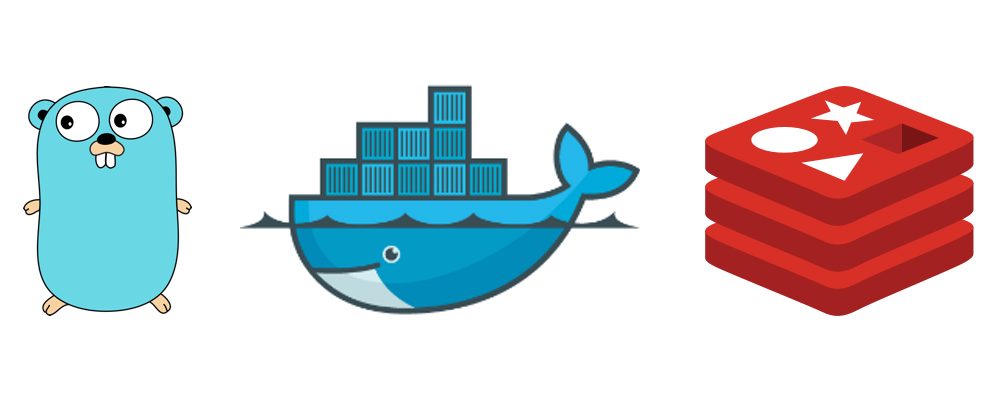

+++
date = "2016-07-18T00:10:35+02:00"
strap = "A tutorial on building a simple URL shortener API with Golang, Docker, and Redis."
title = "20 Minute URL Shortener with Go and Redis"
+++

As we move monoliths to microservices at work, I've found myself using [Go](https://golang.org) (aka Golang) quite a bit. It's getting to the point now that I'm actually reaching for it it for tasks that previously I would have used Node.js for. CLI tools, small APIs, anything where concurrency is important too. I'm finding it quite a pleasant language to develop in - and, just as importantly, a pleasant language to deploy. The ability to compile a binary very easily for any target platform is killer, and it's very easy to set up a nice development environment with very short feedback loops.



Let's look at building a small service to shorten URLs with Go and the excellent [Iris](https://github.com/kataras/iris) web framework. We'll use Docker for our development environment (so we can have an isolated, containerised, deployable environment), and Redis (an insanely fast key/value store) as a persistence layer. As for building a front-end, I'll leave that as a further exercise - but of course the system will be decoupled enough to build one using any JS framework you like.

> It's worth noting that the Iris web framework has a plugin to support Typescript compilation, which gives you a particularly excellent experience when combined with Go. Since both have static typing and structs you can use the same data structures everywhere.

Before we get stuck in, make sure you have [Docker installed](https://beta.docker.com/), and of course a [capable text editor](https://sublimetext.com/3). This should only take about 20 minutes to follow, and by the end of it I'm hoping you'll have a better understanding of how to throw small, containerised services together with Go.

## Setting up a development environment

We'll start by setting up our containers - one for Go and one for Redis. Create a `docker-compose.yml` file and add the following to it:

```
version: '2'
services:
    go:
        build: ./docker
        ports:
            - "3000:3000"
        external_links:
            - redis
        volumes:
            # Add your own Github username
            - .:/go/src/github.com/<YOUR USERNAME>/gourl
        environment:
            - REDIS_HOST=redis
            - REDIS_PORT=6379
            - IRIS_PORT=3001
            - DEBUG=true

    redis:
        image: redis:3.2-alpine
        volumes:
            - ./docker/storage/redis:/data
        command: redis-server --appendonly yes
```

You'll notice that we're going to be creating our own image for the Go container - this is because we need to install some dependencies over what comes with the official Go container. Create a file at `Docker/Dockerfile` and add the following:

```
FROM golang:1.6-alpine

# Add your own Github username
ENV APP_DIR $GOPATH/src/github.com/<YOUR USERNAME>/gourl

ADD . $APP_DIR
WORKDIR $APP_DIR

RUN apk --update add git && rm -rf /var/cache/apk/*

# Install packages.
# Ideally we'd use `godep` for this, but to keep this short
# we'll just install them manually here.
RUN go get -u github.com/kataras/iris \
    go get -u gopkg.in/redis.v4 \
    go get -u github.com/codegangsta/gin

EXPOSE 3000
CMD gin run
```

There's just a couple of things to note here - firstly we're using Alpine Linux, to keep container size down, so we have to install packages with `apk` instead of the more familiar Debian `apt`. Also, we're installing something called `gin`. This is a utility that will watch our Go application for changes and compile it on the fly. Gin will listen on port 3000, so we expose that, and by default proxies requests to port 3001 - which we'll bind Iris to.

> Confusingly there are two projects called `gin` for Go - the other is a web framework. No, I don't know why they share a name, but I can understand a love of gin 🍸. Luckily, in Go we specify the absolute URL of the package to import, so there's no real risk of collision there beyond a little confusion.

With that in place, we're ready to `docker-compose up -d` and then start coding.

## Shortening a URL

So we'll start by creating a `main.go` file and create an endpoint, to POST new URLs to be shortened to. We'll also create a Redis connection now, which we'll use in a mo.

```go
package main

import (
    "fmt"
    "github.com/kataras/iris"
    "gopkg.in/redis.v4"
    "os"
)

// Open a connection to Redis
var redisStorage = redis.NewClient(&redis.Options{
    Addr: fmt.Sprintf(
        "%s:%s",
        os.Getenv("REDIS_HOST"), 
        os.Getenv("REDIS_PORT"),
    ),
})

// Custom `*iris.Context` struct to bind our functions to
type UrlAPI struct {
    *iris.Context
}

// Handler for Post route
func (u UrlAPI) Post() {
    url := u.FormValue("url")
    u.Write(url)
}

func main() {
    defer redisStorage.Close()

    iris.API("/", UrlAPI{})
    iris.Listen(fmt.Sprintf("0.0.0.0:%s", os.Getenv("IRIS_PORT")))
}
```

The `iris.API()` method binds a resource to REST-style endpoints, identified by the method names you specify. So here, the `Post()` method is bound to `POST /`.

The server should now echo back any `url` FormData value we send. Try it with `curl -X POST -F 'url=http://google.com' http://localhost:3000` - or use [Postman](https://www.getpostman.com/) of course.

So, next up we want to save the URL to the Redis instance. We can achieve this quite easily by generating a new unique key with Redis' `INCR` operator, and then save a key/value pair of this incremented number next to the URL.

> This is definitely not the most efficient way of doing this, but it's less code, as we defer key generation to Redis. In production applications, you might want to generate the key yourself. For this exercise, both Go and Redis are fast as hell anyway, so we won't run into problems.

So let's delete that `Post()` endpoint, and replace it with the following two methods:

```go
func getNextKey() int64 {
    // INCR in Redis
    err := redisStorage.Incr("key").Err()
    if err != nil {
        panic(err)
    }

    // GET the key we just INCR'd
    key, _ := redisStorage.Get("key").Int64()

    return key
}

func (u UrlAPI) Post() {
    url := u.FormValue("url")
    key := getNextKey()

    // SET { URL_<key>: url } in Redis
    err := redisStorage.Set(fmt.Sprintf("URL_%d", key), url, 0).Err()
    if err != nil {
        u.JSON(iris.StatusInternalServerError, iris.Map{
            "error": "Failed to save",
        })
    }

    // Respond with JSON
    u.JSON(iris.StatusCreated, iris.Map{
        "location": url,
        "key":      key,
    })
}
```


Now, making the same POST request again will return a number, which will be our shortened URL. So if we receive `15` back, then the shortened URL will be at `http://localhost:3000/15`. Let's get that working.

## Resolving a shortened URL

Our last task for this little API is to make a `GET` request to resolve a short URL into its long counterpart. This is pretty easy: 

```go
func (u UrlAPI) GetBy(id string) {
    // GET URL_<key> from Redis
    url, err := redisStorage.Get(fmt.Sprintf("URL_%s", id)).Result()

    // 404 if that key doesn't exist in Redis
    if err != nil {
        u.JSON(iris.StatusNotFound, iris.Map{
            "error": fmt.Sprintf("Not found: %s", id),
        })
        return
    }

    // We could return with a redirect here, but I'm going to return JSON
    // so we can deal with the redirect from a hypothetical front-end.
    u.JSON(iris.StatusOK, iris.Map{
        "location": url,
    })
}
```

Now, follow our application flow to test it out: send the same `POST` request we sent earlier, then hit the ID you receive back with a `GET` request. You should see the details of the URL you posted.

## Taking it further

I'm going to wrap this up here, but hopefully I've shown you how simple it is to get started with Go, and helped you dip a toe in yourself. The code for this is available on [my Github](https://github.com/kieranajp/gourl) if you want to take a look.

To take this to the next level, it would be cool to build a front-end on top of it. We can [easily render a template with Iris](https://kataras.gitbooks.io/iris/content/render_templates.html) and from there, it's pretty simple to make the endpoint requests with AJAX.

As always, if you have any questions or comments, you can reach out to me on [Twitter](https://twitter.com/kieranajp) - I'd love to hear any feedback you might have.
