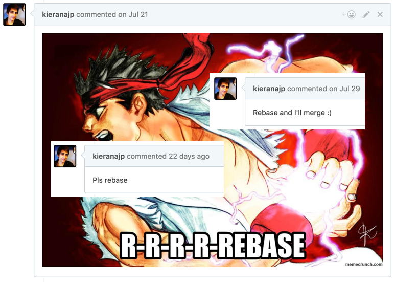
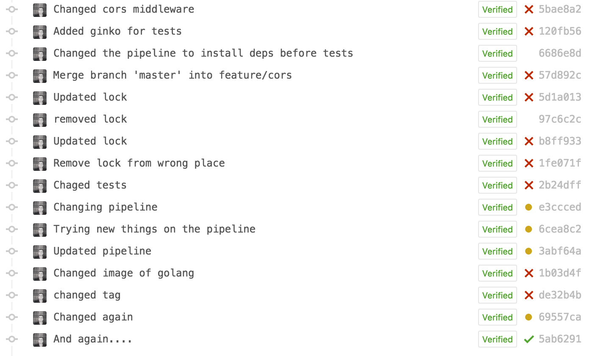
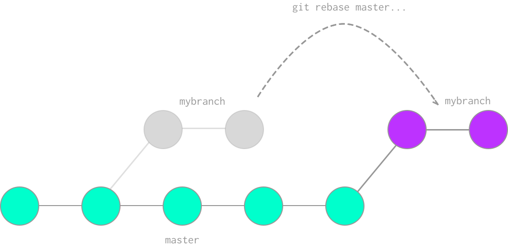

+++
date = "2016-12-01T20:00:42+02:00"
strap = "I'm always asking my team to clean up their Git history. Here's what I mean by that."
draft = true
title = "Confessions of a Serial Rebaser"
+++

We use a pull request workflow at work, and in doing so I've gained somewhat of a reputation. See, I'm often "that guy" who, when doing a code review, will ask for the pull request's commits to be rebased.



What do I mean by this? The process of rebasing in Git is, in essence, rewriting history to tidy it up. We can remove ugly merge commits, reword commit messages that aren't descriptive enough, erase "fix typo" commits so that it appears the typo never happened, and even change the order changes were made in to better describe the flow of building out a feature. In short, we can make our pull requests make more sense when going back to view changes in future. No more of this:



There's two "types" of rebasing (strictly speaking not true, but it's how I think of it) that can help with this situation.

> Please read the article to the end before trying to follow along, especially with an important repository! The following process can be destructive if done wrong, and I can't be liable for any lost work. Don't do this on a shared branch unless you've communicated with the colleagues you're sharing it with, and definitely don't do this on your master branch. You've been warned!

### Rebasing master in

Firstly, by rebasing master into your branch, it's like your commits all occurred _after_ the work that was done in master. Chronologically this may not be true, but this allows master to read as a history of what was merged when (and for us with continuous deployment, what went onto our staging server when). This means you don't need to merge master into your branch as this has the same effect, allowing for a clean merge when the PR is complete. 

This is super simple to achieve. First, make sure you have everything up to date locally in both your own branch and master:

```
$ git checkout master
$ git pull origin master
$ git checkout my-branch
$ git pull origin my-branch
```

> N.B.: I use [`git-up`](https://github.com/aanand/git-up) to avoid these branch gymnastics, so I can pull all remote branches with one command: `git up`. It's really worth setting something like this up!

Anyway, now this housekeeping is complete (and it really is an essential step, so don't skip it!), we can actually perform the rebase. From your own branch:

```
$ git rebase master
```

Git will take the current state of master and put your work after it. It's almost like you created a new branch fresh from master and recreated your commits from scratch in that new branch, only without the hassle.



This has the added benefit that, if there are any merge commits ("Merge branch 'master' into my-branch"), they'll be removed. Great! That's one step towards a cleaner history already!

### Rebasing to change history

This is the second type of rebase I'll talk about here, and while there are a few ways to achieve this, I like to use an "interactive" rebase. The first thing to do is to work out how far back in time you want to go, in terms of number of commits. You could simply use a `git log` to work this out.

Let's say we have a git history a bit like this:

```
$ git log --oneline

9c6e0a9 fix typo
7fadd64 Finished refactoring repository.go
bf460ea wip on repository.go
99beecc Refactored main.go
```

Perhaps we'd want to reduce those previous three commits into one commit simply labelled "Refactored repository.go". In Git terms, we want to "squash" three commits together, and we can do this with an interactive rebase. Running `git rebase -i HEAD~3` will pop us into a temp file in our editor, asking for clarification on what we want to do with these 3 commits.

```
pick bf460ea wip on repository.go
pick 7fadd64 Finished refactoring repository.go
pick 9c6e0a9 fix typo
```

Below this instructions are kindly provided (thanks Git!), but in short you want to change the first word of each line to match what you want to do to that commit. We want to `squash` these three commits into one, so we can change the instruction for the last two commits here to `squash` (or `s` for short). Vim's `ciw` (change inside word) is invaluable here!

```
pick bf460ea wip on repository.go
s 7fadd64 Finished refactoring repository.go
s 9c6e0a9 fix typo
```

When we save and quit this, Git will run through the rebase and then pop open another editor, asking us what the commit message for our new, combined commit will be. Changing this message to "Refactored repository.go" will finally give us the commit history we're after:

```
33906a2 Refactored repository.go
99beecc Refactored main.go
```

### Push it real good

You may want to push your work now, and if you'd not pushed your branch originally this would work trivially. However, if you've already pushed, you might find that trying to push again results in an error from your Git remote saying your push was "rejected".


Simply `git push -f` (force push) to get around this! However, **this is the dangerous part**. Ensure nobody else has pushed to your branch in the meantime, since you last pulled, or you'll be wiping their changes out and they will not be friends with you anymore.

Additionally, I highly recommend here making a change to your git settings: `git config --global push.default current`. Without this config value, Git can push more than one branch to the remote, potentially overwriting work on other branches you had nothing to do with.

Be extremely mindful of what you're doing when running a force push, and you'll be fine. However, it's not a command to be careless with.

### Demand satisfaction

If you're using a sensible git branching model, the benefits of having a clean history are well worth the risks. We can look back and see when a bug was introduced, and additionally we can clearly see the context of the changes that introduced a bug by having a non-polluted history to read. Even 3-6 months down the line, we'll still be clear on what was happening in context, and what else was being worked on around the same time, even if the developer who was working on it is no longer around.

If the history is polluted with merge commits, "wips", and "fix typos", it becomes much more difficult to remember what was going on back then. Better to rebase that typo out of existence rather than dedicate a commit to a one-letter change.


By having a policy of only merging pull requests with a neat history, you gain a few benefits, and your repository looks far more… _professional_ for it.
