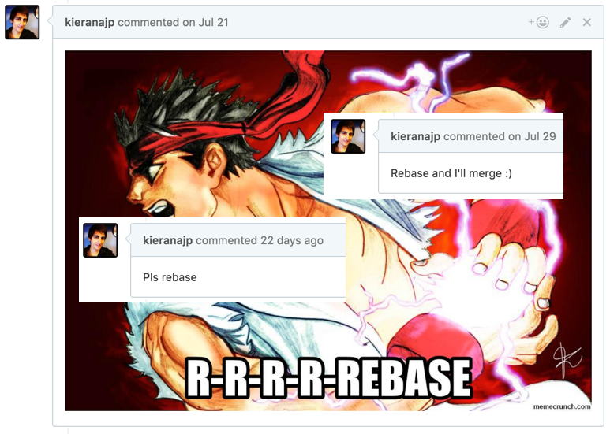
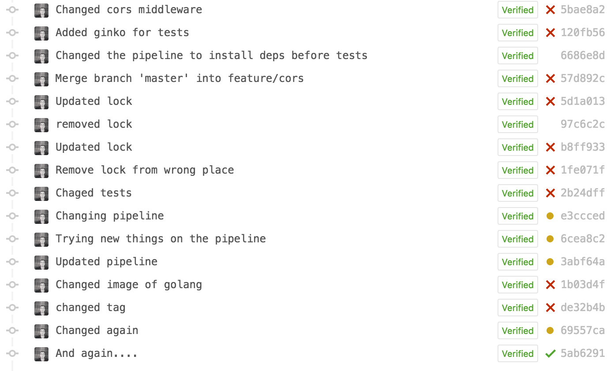

+++
date = "2016-09-28T23:00:42+02:00"
strap = ""
title = "Confessions of a serial rebaser"

+++

We use a pull request workflow at work, and in doing so I've gained somewhat of a reputation. See, I'm often "that guy" who, when doing a code review, will ask for the pull request's commits to be rebased.



What do I mean by this? The process of rebasing in Git is, in essence, rewriting history to tidy it up. We can remove ugly merge commits, reword commit messages that aren't descriptive enough, erase "fix typo" commits so that it appears the typo never happened, and even change the order changes were made in to better describe the flow of building out a feature. In short, we can make our pull requests make more sense when going back to view changes in future. No more of this:



There's two "types" of rebasing (not really, but it's how I think of it) that can help with this situation.

Firstly, by rebasing master into your branch, it's like your commits all occurred _after_ the work that was done in master. Chronologically this may not be true, but this allows master to read as a history of what was merged when (and for us with continuous deployment, what went onto our staging server when). This means you don't need to merge master into your branch as this has the same effect, allowing for a clean merge when the PR is complete. 

This is super simple to achieve. First, make sure you have everything up to date locally in both your own branch and master:

```sh
$ git checkout master
$ git pull origin master
$ git checkout my-branch
$ git pull origin my-branch
```

I use [`git-up`](https://github.com/aanand/git-up) to avoid these branch gymnastics; so I can pull all remote branches with one command: `git up`. It's really worth setting something like this up!

Anyway, now this housekeeping is complete (and it really is an essential step, so don't skip it!), we can actually perform the rebase. From your own branch:

```sh
$ git rebase master
```

Git will take the current state of master and put your work after it. It's almost like you created a new branch fresh from master and recreated your commits from scratch in that new branch, only without the hassle.


This has the added benefit that, if there are any merge commits ("Merge branch 'master' into my-branch"), they'll be removed. Great! That's one step towards a cleaner history already!


