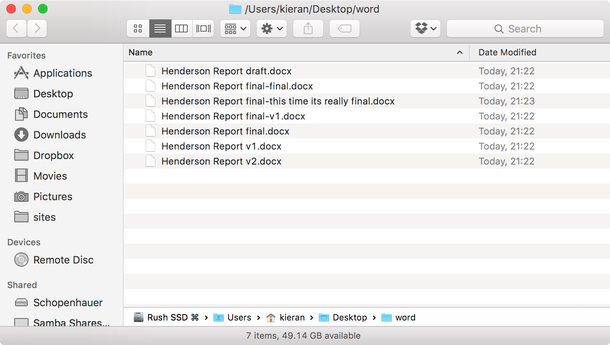
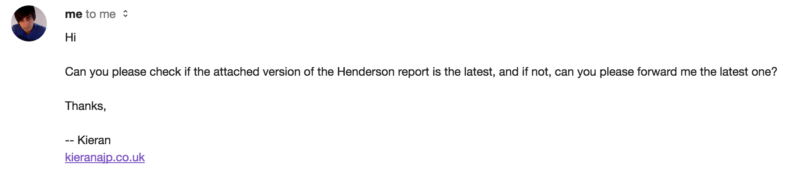

+++
date = "2014-10-01T22:11:51+01:00"
title = "Version Control is not scary or hard!"
strap = "Even if you're not really technical, I believe you can really benefit from Version Control."
+++

Recently, I was reminded (by virtue of a panicked tweet from a designer who had deleted a website) that there are many people making websites today who are unfamiliar with the concept of version control.

Had the designer been using version control, this would have been little more than a mild inconvenience; not remotely worth panicking about.

Now I've seen many an "introduction to Git" article around that does little more than list a series of Unix commands, guaranteed to turn anyone who is not already comfortable with using Git via the command-line off within about four seconds. These, I feel, are not accurate represenations of how one could be using Git, and do more harm than good.

Version control is not hard. It's not scary. It does not require any programming knowledge, and despite what you may read on some sites, does not require ever opening a Terminal window in order to reap the benefits.

I've even set up some clients, who would not describe themselves as technical, using version control to make content updates.

> N.B.: There are a whole bunch of different version control systems out there, each with different pros and cons - Subversion (SVN), Mercurial (HG), and Team Foundation Server (TFS), to name but a few. However, arguably the most popular (and my personal favourite) is Git, so while the crux of this article pertains to any version control system, I'll be using the Git vernacular.

## Okay, what does it actually give me?

Does this look familiar?

This is, in a way, a very primitive form of version control; after all, you are keeping track of versions to keep some sort of a history.

How about this?

If you're using version control, you can kiss goodbye to this scenario.

A VCS allows you to turn a regular folder on your computer into a 'time machine' (or 'repository', but that doesn't sound quite so cool). Within that folder, every change you make to a file is tracked, and at any point you can 'save' your progress (this is called a 'commit', in Git nomenclature). It's possible to move between commits - travel through time, if you will. Want to see what a file looked like a year ago? It's easy to find out. Want to experiment with some changes, but have piece of mind in case something goes wrong? Go ahead, you can roll the changes back if they don't work out, or keep them if they do.

> For me, version control has become the equivalent of `File > Save` in the 1990s: saving your document took a minute or two, so you didn't do it so often. These days, I at least have `cmd+s` compulsion (or even autosave), so the habit of making a conscious decision of saving for me has moved to committing, instead.

### Git servers

The magic really happens, though, when you hook the repository up to a Git server. You may have heard of GitHub or Bitbucket - these sites provide Git servers for you to use with none of the setup hassle. Doing so will create a full backup of your repository, and all it's time-travelling capabilities.

Want to transfer your work to a laptop for the road? Download the complete repository from the server. Your computer gets stolen or broken? Download the complete repository from the server. Not sure if you have the latest version? Pull down from the server to bring yourself back up to date.

The scenarios in the images above literally become ancient history.

### Git for deployment

If you're making a website, with a little configuration Git can even be used for deployment. See if this sounds familiar: firing up an FTP client and painstakingly uploading each file you've changed, then worrying whether or not somebody has made their own changes on the server that you might be overwriting, then finding out the next day that your changes have been overwritten by someone else. If your server is configured to just pull the latest changes from Git, you can turn off FTP (which you really shouldn't be using anyway), and all of the above problems simply cease to exist.

## Give Git a Go

No matter how you work, if you're working on anything - even Office files and other typically non-developer stuff! - Git will make your life a million times easier.

Unfortunately, since Git started life as a command-line tool, a lot of the tutorials out there refer to cracking open Terminal.app and typing what some people refer to "gobbledegook".

Don't let this deter you!

While I believe it's important to have an understanding of how the terminal works, if you're just dipping your toe into version control it's easier to use something like the excellent [SourceTree](http://sourcetree.com). With this, you can reap 90% of the benefits of Git without ever even seeing a command prompt.

In fact, this is exactly I've set up some previous, only semi-technical, clients with Git. I've watched designers, content strategists, and copywriters go from zero to competent at using Git/SourceTree in just a few days.

So: designers, SEO consultants, copywriters, accountants - anyone who works with files and folders on a computer in fact: I urge you to please give Git a go. You'll wonder how you lived without it.
