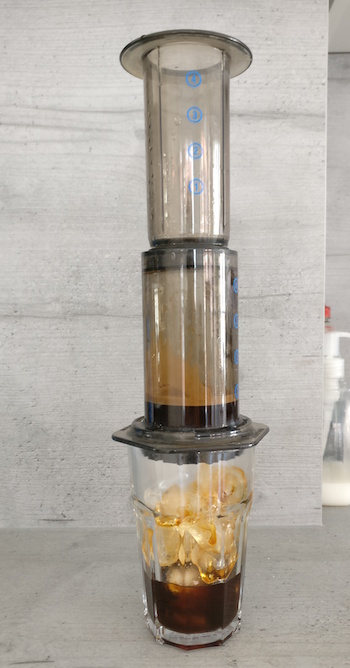

+++
date = "2017-07-05T16:14:28+02:00"
title = "Adventures in Oral Surgery"
strap = "Things to know (and mistakes not to make) if you're undergoing wisdom teeth extraction."
+++

Here's a non-technical blog post for a change: 24 hours after getting my wisdom teeth out, I've decided to chronicle my experience so that others can learn from what's currently helping me recover.

I knew my teeth needed extracting almost two years ago, once my dentist in the UK told me that one of my teeth was severely impacted (lower left), but, knowing I wanted to move country, I put it off until I came over.

And then I put it off some more.

Fast-forward to a couple of weeks ago, when one of the bastards was causing me pain (lower right), and I decided to hit up the dentist and check out my options. She recommended that I have all 4 our—the two lower ones needed doing, but if I want to get my top row straightened up in future (which would be nice) then the other two would have to go as well. I opted to get all four out at once—a decision I stand behind, as I wouldn't want to go through this twice. A couple of weeks later, I was in the *oralchirugie* with a hood over my face, a circular saw in my mouth, and sweat running down my back.

### The surgery itself

Before the surgery I'd made sure to clean and tidy my apartment (though I forgot to make the bed—first mistake). I'd stocked up on ibuprofen, soup, smoothie, [off-brand Soylent](https://queal.com/), which turned out to be esesential (first tip). I also got an Xbox in preparation 😜. The surgery was booked for the afternoon, which was great as it meant I could sleep sooner (tip two).

Actually, the procedure was entirely painless (local anaesthetic is great stuff), but it was less than pleasant having my teeth cut up into tiny chunks, forcibly jerked out of the gum, and vaccumed up (hopefully before they fell down my throat). 1/5, would not recommend.

Throughout the surgery I was trying hard to let my shoulders and back go limp, and not tense up. It was harder than expected, but it gave me something else to focus on, and possibly saved me some back pain and knots (third tip). At one point I felt cold liquid running down my throat and almost choked on it—turns out it was just water and I should have just swallowed (second mistake). The surgery lasted about an hour; [Edele](http://edelegormley.xyz) insisted on being in the waiting room the whole time, and while I was resistant to it at first, I ended up really glad she was there 😊.

Afterwards, I was totally unable to speak (local anesthetic is weird stuff) and just wanted to go home. Mistake three: because of aforementioned numbness, I didn't realise I had two bits of gauze in the corners of my mouth, and one slipped to the front, allowing blood to dribble down my chin on the S-Bahn. For those of you who've been on Berlin's public transport systems, you'll know that I wasn't even nearly the weirdest person on there, but I sure felt self-conscious. 

<figure>
    

        <iframe src="https://www.youtube.com/embed/YEYim54pJ00" frameborder="0" allowfullscreen></iframe>
    

    <figcaption>
        Yeah, Berlin public transport is weird. ("Is mir egal" means "I don't care", roughly).
    </figcaption>
</figure>

### The first few hours after

When I got home I got rid of the piece of gauze in the wrong place (there was no way I could put it back without being able to move my mouth). Then something unexpexted happened: I was at sixes and sevens, not knowing what to do with myself. I didn't want to sit or lie down, and I was in no pain yet, so I resorted to pacing around the apartment and reading the advice I'd been given:

- No dairy for a few days (because bacteria)
- No hot food or drink for 1-2 days (because cold is better for swelling)
- No sauna (yes, this was really on there!)
- Use ibuprofen and ice to combat the pain and swelling

I still couldn't speak so resorted to writing with a whiteboard marker on the window to communicate. My sense of humour never left me, but laughing was agony. Blood was dribbling down my chin so I filled a paper cup up with tissues and held it under my face to catch it / spit into. I considered an elaborate setup with paperclips to hold it there, but I thought the bleeding would stop soon. In fact, it didn't. Tip four: do the cup thing, and have plenty of tissues / loo roll on-hand.

<figure>
    
    <figcaption>
        Despicable Me jokes are key.
    </figcaption>
</figure>

Once the anaesthetic started to wear off my face was in agony, and I started to get a headache too (I miss local anaesthetic already 💉). At this point I had to spit the remaining piece of gauze. I was able to take some ibuprofen and a couple of small sips of water. I felt cold (I guess from the blood loss) so sat under a blanket and napped for an hour. I thought I'd be hungry, but I guess the pain, adrenaline, and all the blood I was drinking were keeping that at bay. Mostly I was just thirsty and tasted foul.

I went to bed without brushing my teeth (God, I miss brushing my teeth most of all) with a glass of water and a fresh paper cup, and woke up several times to sip water / spit blood. Luckily, I didn't mix the two cups up.

### I love my toothbrush

The next day (today!) I woke up tasting *disgusting*, and spent a lot of time in the bathroom just spitting out thick, dehydrated, foul-smelling saliva. The bleeding must have slowed to an ooze, because my spit was just kind of pink now, not full-on mouthfulls of blood. I looked a lot like Droopy, if Droopy had two lemons in his mouth. No, I didn't take any pictures. I brushed just my front teeth a couple of times and used the smallest sip of mouthwash, which helped. I was able to drink about half a portion of fake Soylent (so about 350 calories) and I felt a bit stronger after that. I expected to be able to do some coding, but the pain and possibly the blood loss left me unable to concentrate, so I just played Xbox for a couple of hours and then [read my book](http://www.goodreads.com/book/show/7937744-surface-detail) for a couple more.

### *Eiskaffee*

At about 2:30pm the caffeine headaches kicked in, so bearing in mind I couldn't have dairy or hot drinks (and also wanting to avoid sugar, even though it wasn't explicitly *verboten*) I decided to make black iced coffee (tip five!). I added a double scoop of coffee to an [Aeropress](https://aerobie.com/product/aeropress/), about half-filled it with hot water, and stirred for 90 seconds (colder coffee requires that much more strength to taste any good), then plunged it into a glass full of ice and stirred. Worked quite well, really, and that first hit of caffeine was bliss. Yes, I'm a junkie.

Now, I'm feeling a ridiculous desire to brush my teeth more than anything else. That will have to wait another day or so, though. The hunger's kicking in again soon, which is probably a sign that I'm healing. My plan tonight is to try some lukewarm soup, as while Soylent has "everything the body needs", it doesn't really stop the hunger pains for long as I guess I'm not used to it yet.

<figure>
    
    <figcaption>
        Soylent: better than Tasty Wheat™
    </figcaption>
</figure>

### TL;DR

Hopefully if anyone's searching for advice about their own wisdom teeth extraction, this has helped you. To sum up my tips:

- Get your home ship-shape beforehand, as you won't feel like it later. And make the bed! Preferably with bedclothes that you don't mind getting some blood on.
- Ibuprofen, smoothie, some kind of protein shake or Soylent are essential.
- Consider getting some games and books—the only barrier to getting better is time, so you'll want to pass it faster.
- Book the surgery as late in the day as you can—I should have gone later, really.
- If you're a caffeine addict like me, *eiskaffee* is the way forwards (and I'll always recommend the [Aeropress](https://aerobie.com/product/aeropress/) to anyone who lets me bore them about coffee for more than 2 minutes).

Any questions, additional tips, or personal anecdotes? Let me know and I'll add them here. [You know where to find me](https://twitter.com/kieranajp).
