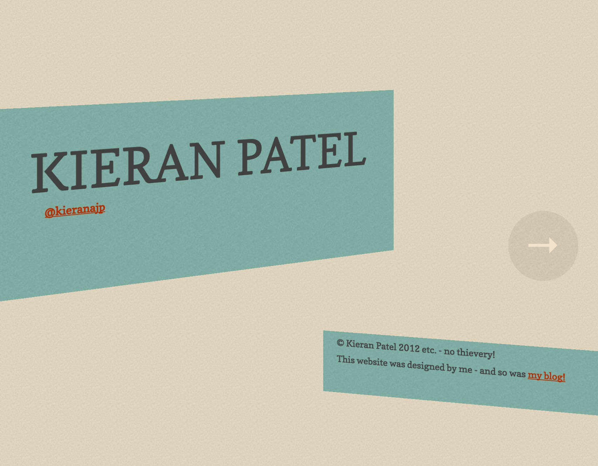

+++
date  = "2016-05-26T23:49:51+02:00"
draft = true
title = "kieranajp.uk"
strap = "Autopsy of the site you're reading right now!"
site  = "https://kieranajp.uk"
link_text = "You're looking at the finished product!"
+++

Having had the same website - with very outdated information, a five-year old design, and a ridiculously out-of-date version of my CV available on it, it had become long past time for me to get myself a replacement, from scratch. For posterity, here's a quick peek at it in all its 2010 glory:

I actually went through two iterations to get to the site you're reading right now. The first was an all-singing, all-dancing, flavour-of-the-month website with React.js and react-router, css-modules, isomorphism, and all that good stuff. In the end, however, I decided to pare all that back, temporarily, to build a more simple version using the [Hugo static site builder](https://gohugo.io) to allow me to iterate more quickly and, importantly, deploy more easily.

The first approach was perhaps me jumping the gun a little and overengineering the solution. However I'm not a fan of throwing the baby out with the bathwater, so a lot of it lives on in the Hugo site, in the learnings I took from the project, and of course in the [annals of Git](https://github.com/kieranajp/websitev3), ready to be applied as a progressive enhancement in the future.

## The New Shiny

I sometimes enjoy working on the front-end (when I'm not fighting with `npm`), and I'm definitely a fan of [React](https://reactjs.com). From a performance point of view and from the end user's point of view, I don't believe React really adds too much over any other sensible JavaScript implementation. However its developer experience is really wonderful. 

It's becoming widely regarded in frontend-land that breaking down everything into smaller and smaller components is a jolly wonderful idea, whether you're working with Vue (💚), Knockout (👬), Polymer (🤓), or Angular (😷); but React, I've found, does the best job in _encouraging_ the developer to think in terms of tiny, reusable components. 

It's this encouragement that got me to start breaking down my initial wireframes down into distinct web components. I knew I needed a basic header and footer with links, and I knew I wanted to have distinct blog posts and case studies; I also knew that they wouldn't make the initial release, but I wanted to have them designed and component-ified anyway.

Building the components themselves out was dead simple, and I was able to quickly style them using [CSS Modules](https://css-modules.github.io), a library / approach I'm still very happy with and highly recommend. I was able to make heavy use of flexbox and avoid using anything heavy like Bootstrap, and came up with a design and CSS implmentation that I was really happy with. The MVP, a single page site built with React and Node.js/Express, was very quickly put together and launched.

However, the problem came with getting this working for adding content. I wanted a way of writing [Markdown](https://daringfireball.net/markdown) files to be converted into JSX and rendered by React - I've built something similar in Express.js / Jade for a client before (though not with React) that worked a treat. However, a busy schedule and client work kept me from being able to make much headway on this, and after some time I decided to try another approach.

## Go, Hugo

As much as I wanted my own solution to the content problem, I decided to not reinvent the wheel. Static site builders are fairly prolific these days, and while I hadn't used one and fallen for it yet, I figured it was worth spending some time searching for one I liked.

Enter [Hugo](https://gohugo.io). I actually found this because my Vim config is based heavily off [Hugo's author's](https://github.com/spf13/spf13-vim), and I was looking at his other repositories. Hugo immediately stood out of the crowd to me because it's a [fairly large open-source Go project](https://github.com/spf13/hugo), and at the time I was starting out learning the language, so I figured that I could learn a bit from reading its source code. It also is very feature-rich, compiles in a flash with hot reloading, and has thorough, professional documentation.

I was able to convert my JSX from the React site over to Hugo's templating system fairly easily, and I also took my CSS Modules and converted them to plain SASS. There wasn't really any need for this second step, but I wasn't working in terms of quite so small and neat components anymore, so I wanted my styling to match the structure of the rest of the site code. As a bonus, Hugo uses a theming system, so if and when the time comes to jazz up my website again I can simply create a new theme, and swap between the two with one quick compile.

## Lessons learned

That's pretty much where the site stands at the time of writing. 

Initially, I made the classic mistake of programmers the world over and _tried to get a bit too fancy_. I was lured in by React, the new shiny, and while it is a joy to work with, it was the _wrong tool for the job_. I wanted to use it, but that made everything look like a nail. I think it would be fun to build a React/JSX based static site builder, but that's was far too much of a chunk to bite off when all I wanted was to start blogging.

However, converting what I'd done to use Hugo was very simple, thanks largely in part to React forcing me to think in terms of small, reusable components. I don't think of the React build as _time wasted_ - in fact, it was a very useful prototype, both in terms of kickstarting my new website and in terms of being able to learn about new things (namely CSS Modules). If anything this comports with the ["plan to throw one out" ethos]() - all in all, a useful educational experience, but my first attempt was the wrong solution to a tangential problem. Ultimately I'm glad that I didn't have to throw everything away - the design and a lot of the CSS remains - but I made the right choice to switch for a "real" static site generator.

Unfortunately, I've not bothered to open-source the site yet, mostly due to licensing problems with the [typeface I'm using](http://www.myfonts.com/fonts/intelligent-foundry/averta-standard/), but I intend to eventually, and the React version of the site [is open-sourced](https://github.com/kieranajp/websitev3).

Now, I have a pretty website, with clean, extensible code, a powerful backend in Hugo, and I'm able to start churning out content (the goal I should have had my eye on all along).
