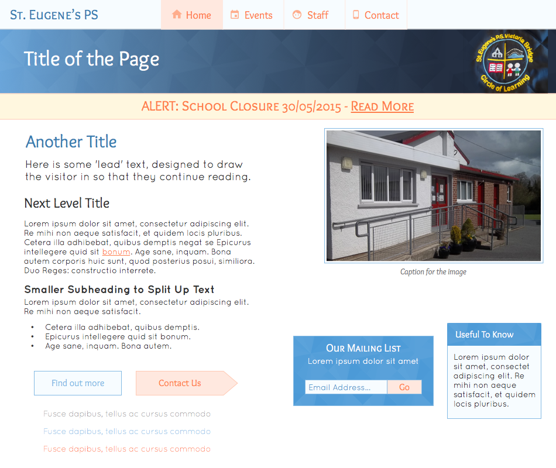
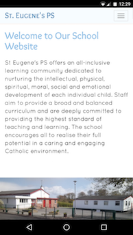

+++
date  = "2015-12-14T23:53:27+01:00"
title = "St. Eugene's Primary School"
strap = "A platform for this little primary school to connect with parents."
site  = "http://www.steugenesps.com/"
link_text = "See the finished product"
+++

This little school in Northern Ireland had managed to scrape together the budget for a small website, so I was thrilled to be contacted and offered the opportunity to design and develop it.

## Requirements

The requirements of the website were simple: the school had zero online presence, and a website would allow them to be easier to find by parents choosing a school for their kids as well as connect more easily with the parents of existing pupils - for example by showing upcoming events, or school closures. The school also put out a monthly newsletter for parents and wanted this to be available online. Based on these requirements, I knew I'd need to offer them an easy-to-use CMS with support for newsletter articles and events - I've extensive experience with [Perch](https://grabaperch.com) so recommended that, as it fits the bill nicely.

The school's only existing brand collateral was their school crest, uniforms, and the aforementined newsletter that didn't really follow the brand at all but was a good indicator of the tone of voice and the sort of content they wanted to put out. My point of contact at the school was fantastic at quickly sending me dozens of reasonably high-resolution photographs of the school grounds and of pupils hard at work. I was also sent the names and websites of some other schools in their immediate area.

## Design & Build

The first stage of the design, as always, was to work out the content. Careful not to get bogged down in their structures, I looked carefully at these other schools' websites to find out what information a primary school website can be expected to provide. Armed with this information (plus the requirements above) I was able to draw up a basic information architecture, and from there use the colours from the uniform and the crest to inform a palette.

After some looking into typefaces and a bit of a back-and-forth with the client to get feedback, it was time to look at design. When creating responsive websites such as this I don't like to create a pixel-perfect layout to be approved, as that's frankly a lie. The layout will not appear the same on different devices with different screen sizes and browser. So I created enough to give the client an idea of what I wanted to build, without committing to a strict page layout.

After getting this approved, I got stuck into coding. As always, I was regularly uploading my progress to a server so the client could watch as the work was completed. As suspected, Perch and its Blog module were more than up to the task. However, the most challenging part of the build was the [Event Calendar](http://www.steugenesps.com/events/), which required some fairly "creative" hacks to get the Events module to render events spanning multiple days.

This being a simple site, though, it was a simple build. The site came in under-budget, and launched in time for the new school year. 

## Results

The school were delighted with their new website, and find the content very easy to update. News and events are updated on a regular basis - hugely important so the content stays relevant - and the site receives a modest but consistent number of visits, mainly through organic search but often via Facebook shares as well. These visitors tend to take their time to peruse the site, too - reading up on the school news mostly - so the site has a fairly low bounce rate.

Interestingly, 51% of the visitors to the website have been from mobile devices or tablets. The low bounce rate within even this context speaks volumes to the benefits of the responsive design, and, I believe, my usual focus on speed and performance.

It remains to be seen if the site will attract more parents and pupils to the school in future school years, but even without that data it's obvious that the site is a great platform for the school to kick off their online presence.
